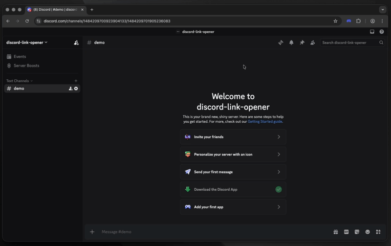

# Discord link-opener

A **Chrome extension** that automatically monitors Discord channels for links matching a regular expression, opens them in your browser, and optionally sends webhook notifications.

## Features

- Monitor a specific Discord channel for new messages containing links
- Filter links using a configurable regular expression
- Automatically open matching links (with configurable delay)
- Send Discord webhook notifications when a link is detected
- Text-to-speech alert on link open
- Side panel UI for easy configuration
- Settings persisted in Chrome storage

## How to use

> [!WARNING]
> The extension might not work with some Discord languages. Tested with `en`, `fr` and `es`.

1. **Install the extension** (see [Installation](#installation))
2. **Open Discord** and navigate to any server page
3. **Click the extension icon** to open the side panel
4. **Configure settings**:
   - **Channel URL**: the Discord channel URL to monitor
   - **Regex filter**: regular expression to match links (optional)
   - **Delay**: delay in milliseconds before opening a link
   - **Open / Notify**: toggle auto-open and webhook notifications
   - **Webhook URL**: a [Discord webhook URL](https://support.discord.com/hc/en-us/articles/228383668-Intro-to-Webhooks) for notifications
5. **Click the play button** to start monitoring

| Open  | Notify | Opens link | Webhook sent | Observes again | Delay applies to                                |
| :---: | :----: | :--------: | :----------: | :------------: | ----------------------------------------------- |
|  ON   |   ON   |    Yes     |     Yes      |       No       | Link opened after delay, webhook sent instantly |
|  ON   |  OFF   |    Yes     |      No      |       No       | Link opened after delay                         |
|  OFF  |   ON   |     No     |     Yes      |      Yes       | Re-observe after delay, webhook sent instantly  |

## Installation

1. Download the latest `.zip` from the [Releases](https://github.com/Mathious6/discord-link-opener/releases) page
2. Unzip the downloaded file
3. Open Chrome and go to `chrome://extensions/`
4. Enable **Developer mode** (top right)
5. Click **Load unpacked** and select the unzipped folder

## Contributing

Open an issue or pull request to suggest features, report bugs, or contribute code.
