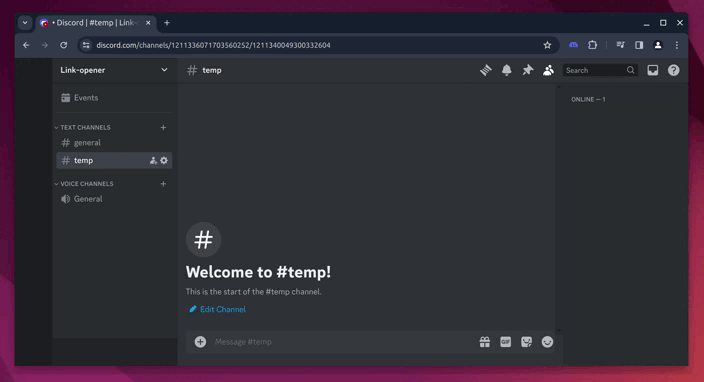

# Discord link-opener 🔗

This **Chrome** extension allows you to **automatically monitor, open links and notify** from Discord in your browser. Thanks to regular expressions, you can automatically open links from your favorite websites without staying on Discord.

The extension will monitor the provided channel, open the first link that matches the regular expressions and notify you when a link is opened.

## How to use 📖

> [!WARNING]  
> Discord language must be set to English.

1. **Install the extension:** Follow [these instructions](#installation-) to install the extension in your Chrome browser.
2. **Open Discord:** Open Discord and click on the extension icon in the top right corner of your browser (this will not work if you are not on Discord).
3. **Customize the extension:** You have to fill the channel URL to monitor, the delay between acions, the regular expressions to match the links you want to open (optional) and the [webhook URL](https://support.discord.com/hc/en-us/articles/228383668-Intro-to-Webhooks) to send notifications.
4. **Enjoy the extension:** The extension will automatically open the links that match the regular expressions and notify you when a link is opened following those rules:

| Open  | Notify | Opens Link | Webhook sent? | Observes again? | Delay effect?                                                            |
| :---: | :----: | :--------: | :-----------: | :-------------: | ------------------------------------------------------------------------ |
|   ✅   |   ✅    |     ✅      |       ✅       |        ❌        | Webhook will be sent instantly and link will be opened after the delay   |
|   ✅   |   ❌    |     ✅      |       ❌       |        ❌        | Link will be opened after the delay                                      |
|   ❌   |   ✅    |     ❌      |       ✅       |        ✅        | Webhook will be sent instantly and it will observe again after the delay |

## Installation 📦

1. **Download the extension:** You can download the extension from this repository by clicking on the green `Code` button and then `Download ZIP` or by
clicking [here](https://github.com/Mathious6/discord_link-opener/archive/refs/heads/main.zip).

2. **Unzip the extension:** Unzip the downloaded file and place it in a folder of your choice.

3. **Install the extension:** Open the Chrome browser and go to `chrome://extensions/`. Then, enable the `Developer mode` and click on `Load unpacked`.
Select the folder where you unzipped the extension and click on `Select folder`.

4. **Enjoy the extension:** You can now enjoy the extension and customize it as you wish.

## Contributing 🤝

If you want to contribute to the project, you can open an issue or a pull request. You can also suggest new features or improvements.
